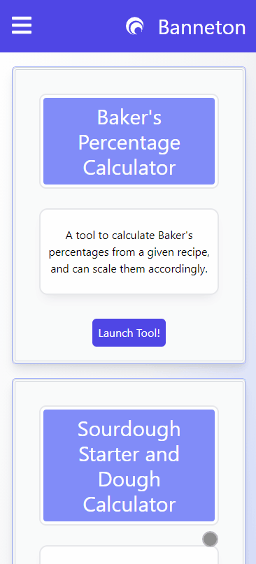
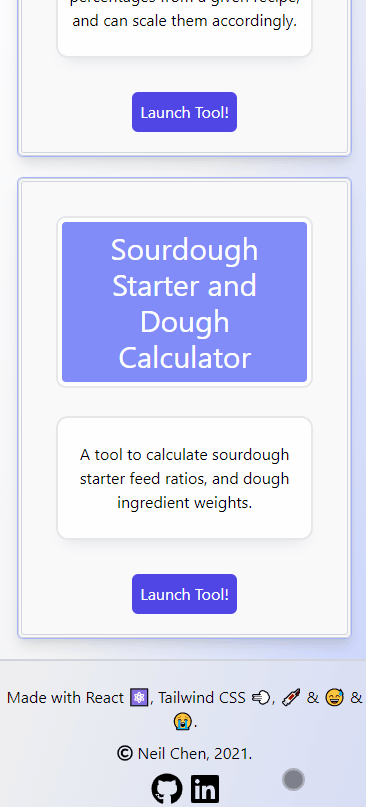

<p align="center">
    
</p>

<h1 align="center"> Banneton - A Social Media Platform for Bread Bakers</h1>
<p align="center">
    
    
</p>

## Table of Contents
* [Description](#description)  
* [Installation](#installation)  
* [Usage](#usage)  
* [Contributing](#contributing)  

## Description

Banneton is a bread baking focused social media platform built with the MERN stack ([MongoDB](https://www.mongodb.com/), [Express](http://expressjs.com/), [React](https://reactjs.org/) and [Node.js](https://nodejs.dev/)), that lets you search and share recipes, images, and engage in discussion. In addition, the application also features some tools to help you along your baking journey. A deployed version can be found [here](https://banneton.herokuapp.com/).

## Installation

To install and run this application locally, you can either run a development build, or create a production build. The development build will run slower than the production since it will be using unminified Javascript files, and the entirety of the Tailwind CSS stylesheet.

### Development Build

1. Make sure you have [Node.js](https://nodejs.dev/) installed on your local machine.
2. You will need to have a MongoDB server installed on your local machine to access the data locally. You can install the community version [here](https://www.mongodb.com/try/download/community).
3. Then clone or download the repository. There are two folders in this repository, one for the front end ( `/client` ) and one for the backend ( `/api` ). Each has their own `package.json`, so you will need to install dependencies for both directories.
```
    // Navigate into the client directory, and run npm install
    cd ./client
    npm install

    // Navigate into the server directory, and run npm install
    cd ./server
    npm install
```
4. You'll need to set up a `.env` file in the `./server` directory, containing the [Cloudinary](https://cloudinary.com/) info you need. Make sure to sign up for an account and get the corresponding infomation, and set up your file like so:
```
    CLOUDINARY_URL=
    CLOUD_NAME=
    API_KEY=
    API_SECRET=
```
5. You'll have to also run both servers that are running on `localhost:3000` (front end), and `localhost:3001` by running the following:
```
    // Navigate into the server directory, and run npm start
    cd ./server
    npm start

    // Navigate into the client directory, and run npm start
    cd ./client
    npm start
```
6. After which, you can open up `localhost:8080` on your web browser to view and use the application.

### Production Build

1. Alternatively, if you want to try out a production build, run `npm run build` in the `./client` directory after installing all the dependencies:
```
    cd ./client
    npm run build
```
2. This will create a new `./build` folder in the `./client` directory. Cut and paste that directory into the root directory of `./server`.
3. Now run `npm start` in the `./server` directory. It will launch a production build of the application on `localhost:3001`.

## Usage

### Home Page
* The landing page for this application. It will display the latest posts that were made. Click on the navigation dropdown to display all the current navigation links.

### Login Page
* Click on the Login link to navigate to the Login page, where a user can sign up for an account and log into an existing account. After signing up for a new account, they will be automatically logged into that account.

### Dashboard Page
* The dashboard page is only visible to a logged in user; if you are not logged in it will redirect you to the homepage. 
* Here, a user can edit their existing posts, and upload a new post.

### Post Page
* A post page will correspond to a specific post that a user has made, with the full details of that bread and recipe that the creator has provided.
* Users are also able to comment on the post. Comments can be deleted, but only by the user that has posted them.

### Search Page
* The search pages allows you to search for and query all the posts by title, tags, and ingredients. Clicking on one of the images will bring up the respective post's page.

### Tools Page
* The tools page contains tools that may be of use for users who may be looking for some extra functionality when it comes to using or developing recipes.
* The Baker's Percentage Calculator lets a user input a recipe, and will calculate the baker's percentages for that recipe. There is also a scaler that lets you scale up/down a recipe based on those calculated percentages.
* The Sourdough Starter and Dough Calculator lets a user input a targeted dough weight, and the respective baker's percentages for water, salt and starter, and will generate the ingredient weights in order to match the dough weight the user has specified. A starter calculator is also provided, which lets the user input their desired starter weight, the desired feeding ratio for the starter, and will output the ingredient weights needed to match the starter weight the user has specified.

## Demo Images
### Post


### Baker's Percentage Calculator


### Dough Calculator


## Contributing

Feel free to fork and make pull requests for any features you would like added. For any fixes or bugs, please submit an [issue](https://github.com/inknsharps/banneton/issues).
